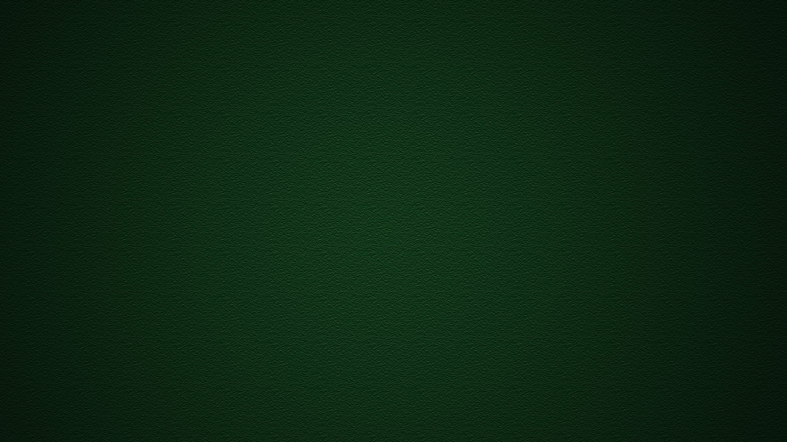

# Snake Game

## Description

This is a classic Snake game implemented using Python and the Pygame library. The game involves controlling a snake to eat apples while avoiding collisions with the boundaries of the screen and itself.

## Features

- **Snake Movement**: Control the snake using arrow keys to move up, down, left, or right.
- **Apple Eating**: The snake grows in length each time it eats an apple.
- **Boundary Collision**: The game ends if the snake hits the boundary of the screen.
- **Self Collision**: The game ends if the snake collides with itself.
- **Background Music**: Enjoy background music while playing the game.
- **Sound Effects**: Includes sound effects for eating an apple and crashing.

## Screenshots



## Installation

1. **Clone the Repository**:
   ```bash
   git clone https://github.com/yourusername/snake-game.git
